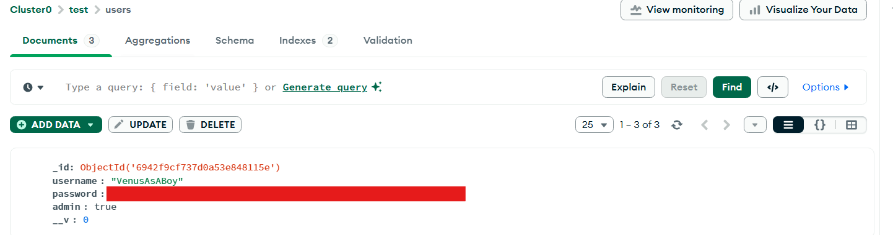
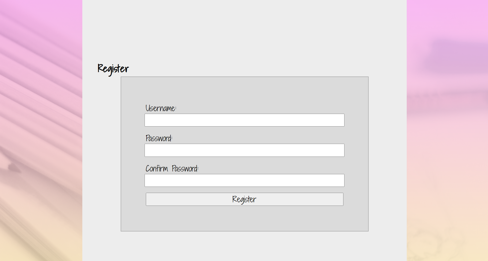
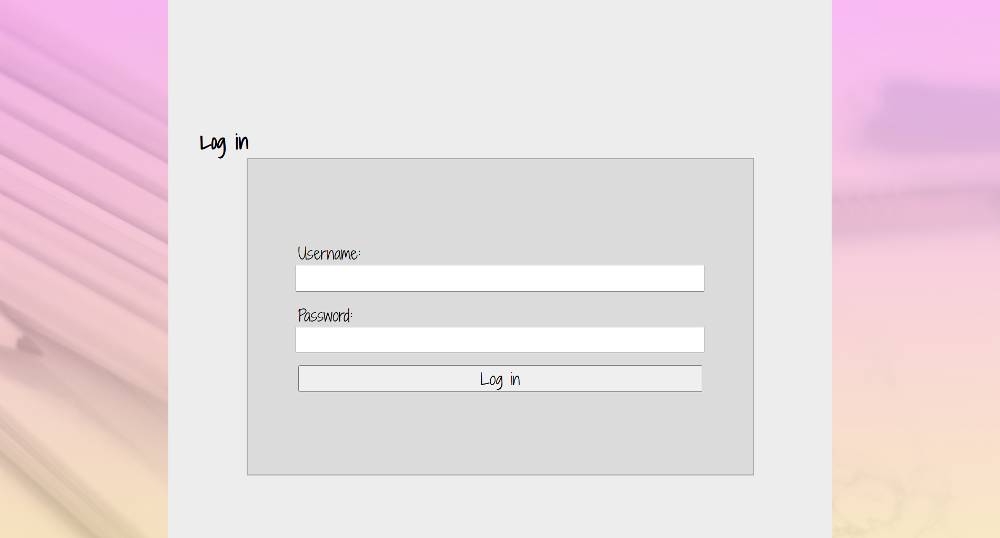
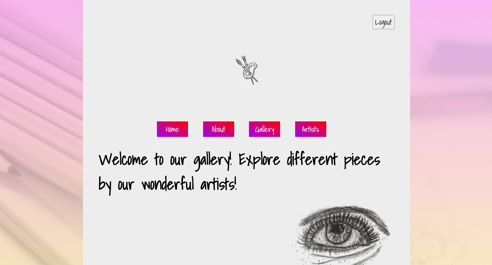
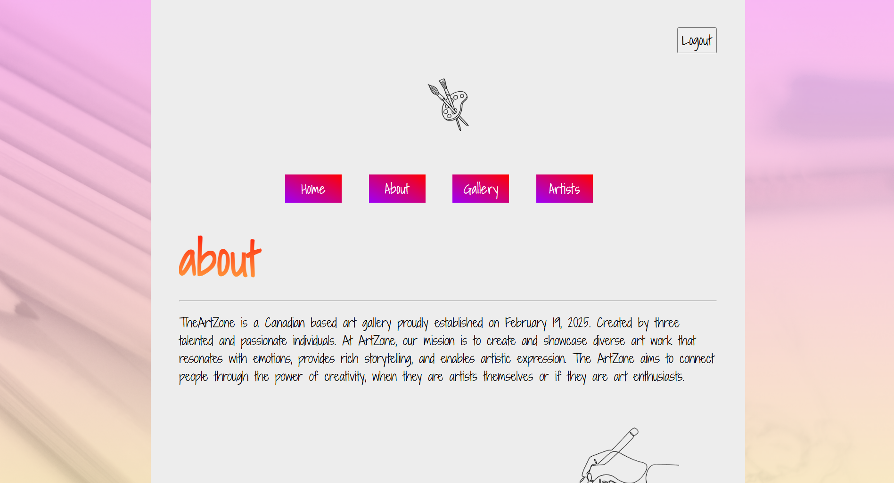
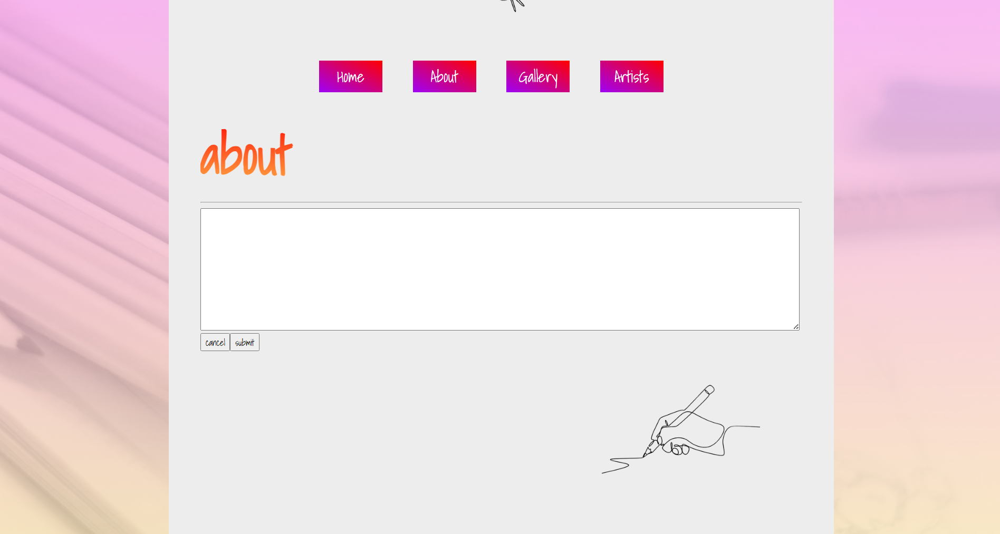
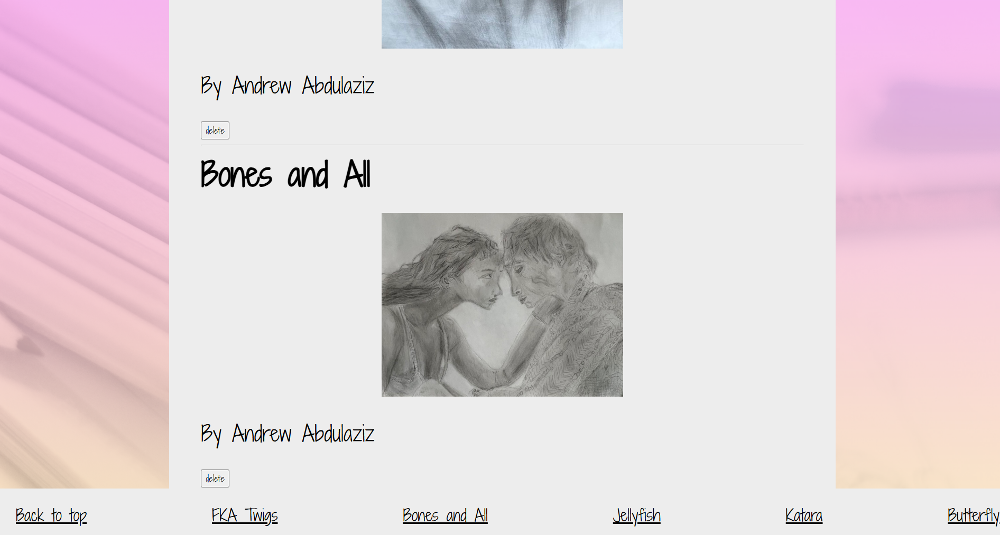
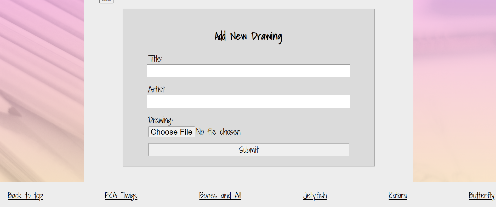
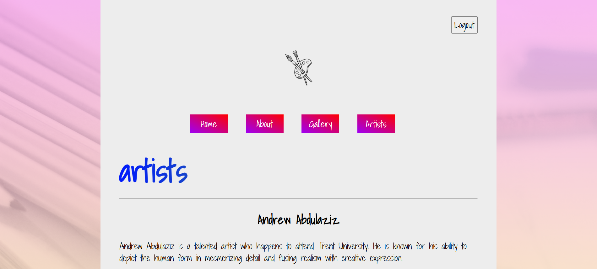
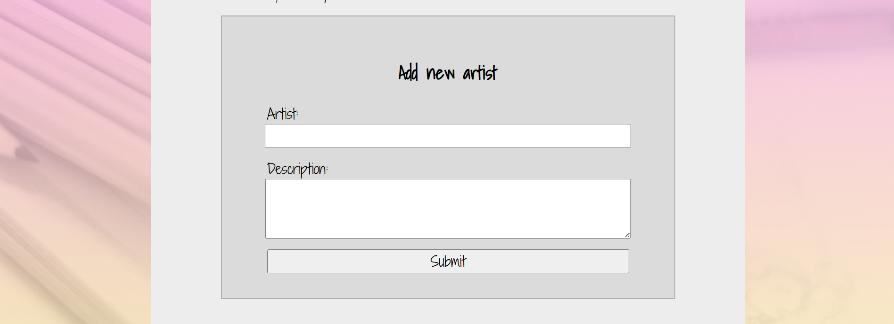

# Gallery Full-Stack App

## Table of Contents


- [Gallery Full-Stack App](#gallery-full-stack-app)
  - [Table of Contents](#table-of-contents)
  - [Introduction](#introduction)
  - [Features](#features)
  - [Tech Stack](#tech-stack)
    - [Frontend](#frontend)
    - [Backend](#backend)
  - [Installation \& Configuration](#installation--configuration)
    - [Pre-requesites](#pre-requesites)
    - [environment variables](#environment-variables)
    - [Steps to install and setup](#steps-to-install-and-setup)
  - [Screenshots \& Tutorial](#screenshots--tutorial)
    - [How to access admin permissions](#how-to-access-admin-permissions)
    - [Registering an account](#registering-an-account)
    - [Logging in](#logging-in)
    - [Home page](#home-page)
    - [About page](#about-page)
    - [Gallery](#gallery)
    - [Artists](#artists)
  - [API Documentation](#api-documentation)

## Introduction

This full-stack application is designed to provide a robust user experience with seamless navigation of various art pieces created by talented artists with a responsive frontend and a secure backed.

## Features

- **Secure Authentication** - JWT for user authentication.
- **Password Encryption** - BCrypt algorithm and salting used to store passwords safely.
- **Input Sanitization** - White spaces and special characters are trimmed/sanitized to prevent injection.
- **RESTful API-driven** - API calls to handle various functionalities that abide by several RESTful principles.
- **Add/View Art** - Admins can add art pieces to gallery. Users can view art pieces.
- **Add/View Artist Descriptions** - Admins can add descriptions of artists to artists page. Users can view these descriptions.
- **Add/View About Page Description** - Admins can add a description to their about page. Users can view this description.

## Tech Stack

### Frontend

- HTML5
- CSS3
- TypeScript
- React.js
- Vite.js

### Backend

- Node.js
- Express.js
- Mongodb
- JWT
- Bcrypt

## Installation & Configuration

### Pre-requesites

- Node.js and npm installed
- MongoDB account and cluster setup

### environment variables

- `MONGOURL` - connection string for your MongoDB cluster.
- `SECRET` - secret used to sign cookies.
- `ORIGIN` - url for your hosted frontend (set this to http://localhost:5173 if using `npm run dev`).
- `PORT` - port which node app is running on (4000 by default).

You must create a `.env` file in the server folder and add these variables in order to run this app.


### Steps to install and setup

1. Clone repository
  
`git clone https://github.com/V3nusAsABoy/mern-stack-gallery.git`

2. Install dependencies
   
```
cd react
npm install
```

```
cd server
npm install
```

3. Configure environment variables in `.env` file in server folder (see environment variables above)

4. Run backend
```
cd server
node api.js
```
5. Run frontend
```
cd react
npm run dev
```
6. Open your browser and navigate to http://localhost:5173

## Screenshots & Tutorial

### How to access admin permissions



Once you have registered your account, open your MongoDB cluster, browse to your users table, and edit the record to change the admin field from "false" to "true". This means any time you log-in to that account, you will get admin permissions.

### Registering an account



Head to the register page by pressing the "register" button. You can enter your log-in credentials here. Make sure all fields are filled, username is unique (not taken), and passwords match.

### Logging in



Head to log-in page by pressing the "login" button. Enter your log-in credentials and you will be redirected to the home-page.

### Home page



This is the page user is initially confronted with.

### About page



You can navigage to this page by pressing the "about" button. The above is a sample description. This is initially empty and must be set by an admin.



You can add the about page description by logging in as an admin, navigating to the about section, and pressing "add description".

### Gallery



Here you an see all the art pieces. You can navigate by either scrolling up/down or using the sidebar. If the amount of art pieces in the sidebar exceeds the screen, you can scroll through it to see the rest of them. By default, there will be 0 art pieces and no sidebar. The sidebar will appear once art pieces are added.



To add an art peice, log-in as admin and scroll to the bottom of the gallery. Enter the name of the art piece, name of the artist, and the file.

### Artists



This is a section where you can see each of the artists who have shared drawings to the gallery and their description. By default this section will be empty.



To add an artist, log-in as an admin, navigate to this page, and add the name of the artist and their description.

## API Documentation

- POST /register - registers new user.
    - Body: username, password
- GET /profile - gets token info of currently logged in user.
- POST /login - authenticates user and returns JWT token.
    - Body: username, password
- POST /artist - creates new artist.
    - Body: name (name of artist), description (description of artist)
- POST /description - creates description in the about section.
- GET /description - gets description for about section.
- GET /logout - clears JWT token info.
- GET /admin - checks whether logged in user is admin (returns 200 if true, 401 if false).
- POST /drawing - creates new drawing
  - Body: title (title of artist), artist (artist who created drawing)
  - File: filename of drawing.
- GET /drawings - get drawings.
- DELETE /drawing/:id - delete drawing with the id specified in the url.

